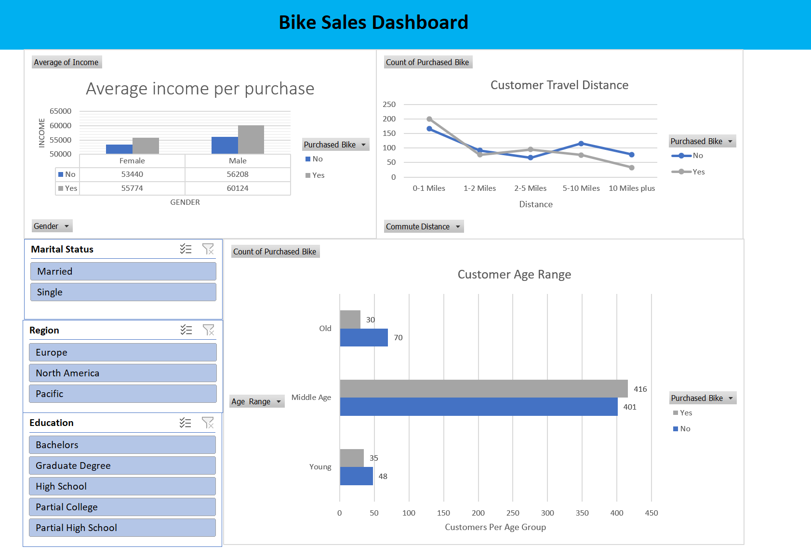

# Excel Bike Sales Dashboard

Who buys bikes, and what makes someone more likely to buy one? This project cleans a dataset of 1,000 customers and turns it into an interactive Excel dashboard that compares buyers and non-buyers by income, commute distance and age.

## Dashboard

The dashboard has three charts: average income of buyers and non-buyers by gender, purchases by commute distance, and purchases by age group. The slicers on the left (marital status, region and education) filter every chart at once.

## Key findings
- **Buyers earn more:** for both women and men, people who bought a bike have a higher average income than those who didn't (for example, about 60K vs 56K among men).
- **Shorter commutes mean more buyers:** customers who commute 0–1 miles are the largest group of buyers. Among those commuting 10+ miles, non-buyers outnumber buyers by more than two to one.
- **Middle-aged customers are the core market:** most customers are middle-aged, and in that group there are slightly more buyers (416) than non-buyers (401). Young and older customers are less likely to buy.

## Data
`bike_buyers` sheet: customer survey data with marital status, gender, income, number of children, education, occupation, home ownership, number of cars, commute distance, region, age and whether the customer bought a bike.

## What I did
- **Cleaned the data** on a separate working sheet: removed duplicate rows and standardised values (for example, M/F → Male/Female, M/S → Married/Single)
- **Added an age-range column** (Young, Middle Age, Old) with a nested IF formula so ages can be grouped
- **Summarised the data with pivot tables** for income, commute distance and age group
- **Built pivot charts** and placed them on one dashboard sheet
- **Added slicers** connected to all pivot tables so the whole dashboard filters together

## How to open
Download `Data scraping with excel.xlsx` from this repository and open it in Excel (desktop). The slicers need Excel 2010 or later.

| Sheet | Contents |
|---|---|
| `bike_buyers` | Raw data |
| `Working sheet` | Cleaned data |
| `Pivot Table` | Pivot tables behind the charts |
| `Dashboard` | The finished dashboard |

## Tools
Excel (data cleaning, formulas, pivot tables, pivot charts, slicers)
